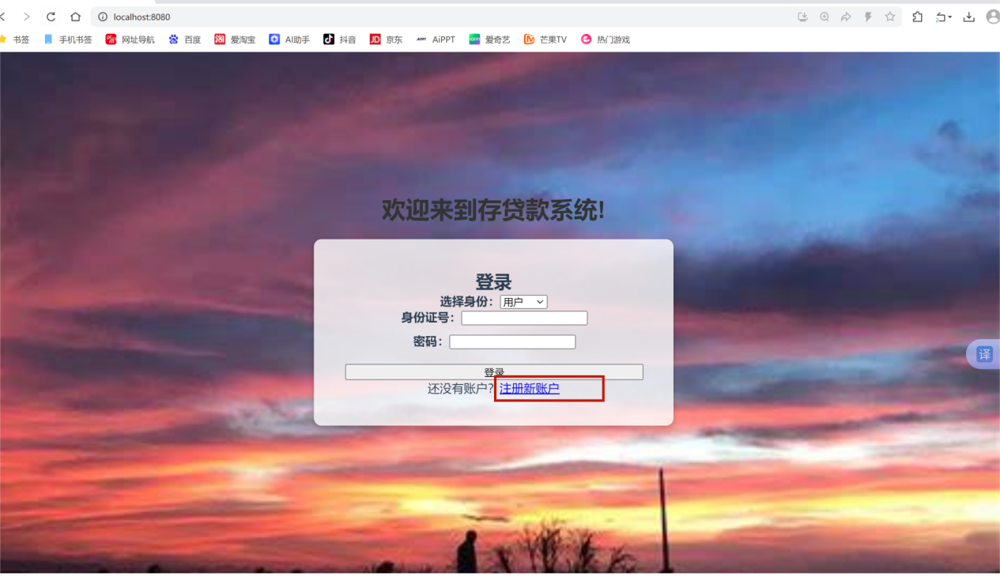
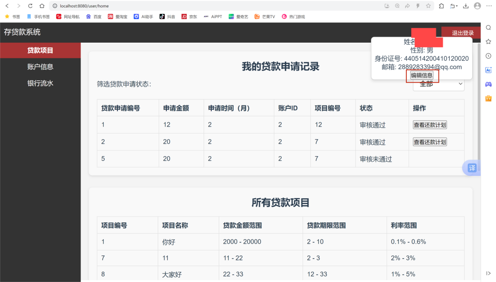
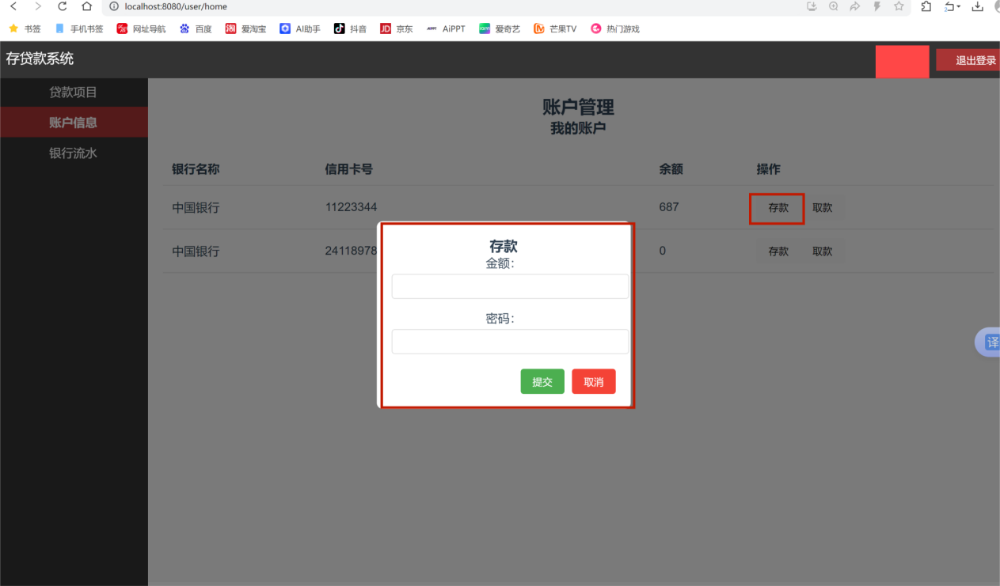
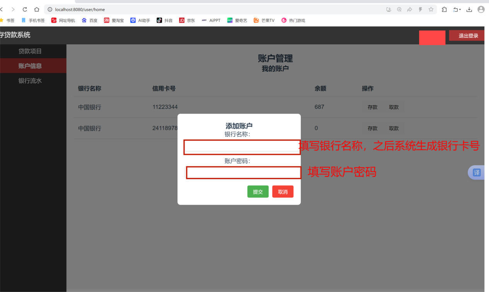
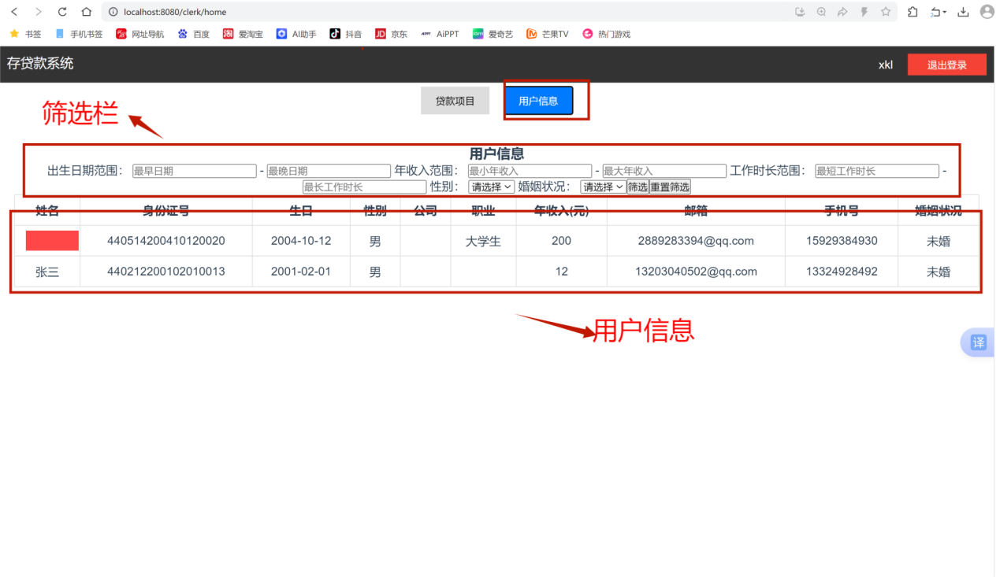
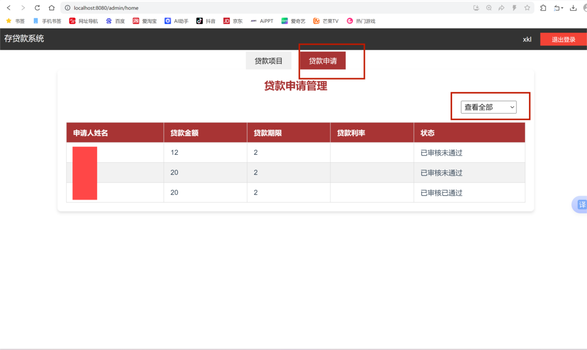

# 安装、使用说明及配置手册
## 系统概述
该系统是一个基于 Spring Boot 和 Vue 开发的存贷款管理系统，旨在为银行客户、营业员、审核员和管理员提供便捷的操作界面和强大的功能。系统支持高效的数据存储、查询、审批、贷款申请等功能。
## 安装步骤
### 环境准备
操作系统：Windows / Linux（兼容性较好，以下以 Windows 为例）
JDK：Java 17及以上版本
MySQL：MySQL 8.0及以上版本（可以根据需求使用其他数据库，需调整配置）
### 2.2准备工作
在安装本系统之前，请确保以下软件已正确安装：
Java JDK（JDK 17 或以上版本）
MySQL 数据库
### 2.3 数据库配置
本系统使用 MySQL 数据库。请按照以下步骤准备数据库：
#### 2.3.1 创建数据库
确保你已经按照操作系统的要求安装了 MySQL并启动Mysql服务，登录 MySQL，创建数据库：
CREATE DATABASE loan_system;
接着导入文件夹下的conf文件夹下的所有.sql文件，这些文件包含了数据库的表结构和初始数据。可以使用以下命令导入：
mysql -u username -p loan_system < path_to_sql_file.sql
注意：请根据自己的数据库用户名、密码和路径进行调整，同时path_to_sql_file.sql要改成自己的sql的文件路径。
#### 2.3.2 配置数据库连接
在conf文件夹下的application.properties文件中，请根据自己的数据库设置修改以下内容：
spring.datasource.url=jdbc:mysql://<数据库IP>:3306/loan_system
spring.datasource.username=<数据库用户名>
spring.datasource.password=<数据库密码>
spring.datasource.driver-class-name=com.mysql.cj.jdbc.Driver
spring.jpa.hibernate.ddl-auto=update
请将 <数据库IP>, <数据库用户名>, 和 <数据库密码> 替换为您实际的数据库连接信息。
## 启动和运行
Windows：
双击 start.bat 文件，或进入文件夹bin之后在命令行中执行：
java -jar system_loan-0.0.1-SNAPSHOT.jar
Linux：
java -jar system_loan-0.0.1-SNAPSHOT.jar
服务启动后，您可以通过浏览器访问 http://localhost:8080 来使用系统。
## 使用手册
### 登录

根据角色的不同，用户可通过以下方式登录：
·  客户：提供身份证号和密码登录。
·  营业员：提供营业员Id和密码登录，访问客户管理和贷款推荐功能。
·  审核员：提供审核员Id和密码登录，审核客户的贷款申请。
·  管理员：提供管理员Id和密码登录，管理贷款项目、优惠设置等功能。

### 客户注册
本系统对客户提供客户注册的功能，点击注册之后填写相对应的信息就可以注册自己的账号：

### 4.3功能简介
#### 4.3.1客户端界面：

功能点1：个人信息管理：客户可查看和更新个人信息。
客户可以将鼠标悬浮在用户名上，会显示自己的基本信息，点击编辑信息可以更改自己的个人信息，其中身份证号、出生日期、姓名和性别的信息不能修改：

功能点2：查看自己贷款申请记录：查看自己的贷款申请记录，查看自己每个贷款未来的还款计划，同时可按是否审核通过筛查自己的带框计划：

功能点3：查看所有的贷款项目，申请相应贷款项目：

功能点4：账户管理：客户可以查看自己的账户信息，进行相应的存款取款操作，同时也可以进行添加账户的操作：

功能点5：查看自己的银行流水信息：

#### 4.3.2 营业员界面：

功能点1：查看所有的贷款项目

功能点2：查看所有用户信息，同时根据要求筛选相对应的用户，可以通过用户的手机号或者邮箱向其推荐适合的贷款项目：

#### 4.3.3 审核员界面

功能点1：对客户提交的贷款进行审核：

功能点2：查看用户的征信记录：在这里可以通过用户的ID查找用户的征信记录，在审核员工作的时候为了判断是否要通过客户的申请记录取决于其申请记录。

#### 4.3.4 管理员界面

功能点1：添加、删除贷款项目信息：

功能点2：查看所有的贷款申请记录：

## 常见问题
无法启动后端服务：
确保你已按照文档正确配置数据库。如果数据库连接失败，系统无法启动。请检查 application.properties 文件中的数据库连接信息是否正确。

